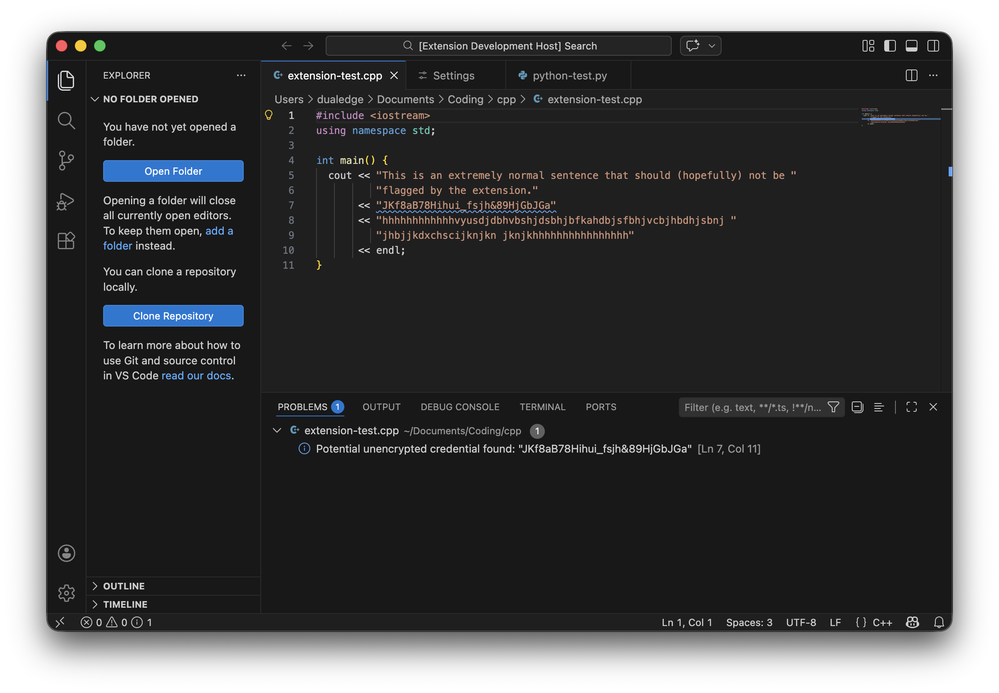
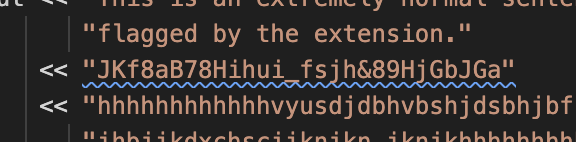
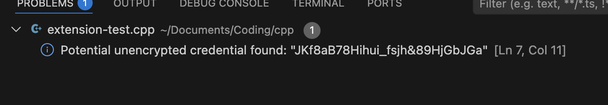

# __Code-Scrubber__

### A security enhancing extension that respects developer control and privacy

Code-Scrubber is a *VSCode* and *VSCodium* extension that *locally* scans your workspace documents for hardcoded API keys and Credentials inside your code. Combatting API leaks in your GitHub repositories. The keys are scanned and reported on your local device for respecting privacy.

---

### Current features:
  - Locally scans potential API keys in strings in code using character entropy and length.
  - Potential keys are showcased in the "Problems" menu in VSCode UI.
  - Ability to ignore leaks for a file for removing annoying false positives, or for test code.

### Planned features:
  - Quick .env creation for dealing with potential leaks quickly.
  - Refining key search algorithm by taking advantage of suspicious patterns via regex.
  - .env encryption with a key.
  - AWS Integration.

**Note that new features may be decided. Expect some issues, this project is very early in development!**

---

### __Screenshots__:

### Showcase:

---

### Key Highlighting and credential reporting:

---

### Extension is supported by the VSCode family of editors. Packaged in .vsix format.