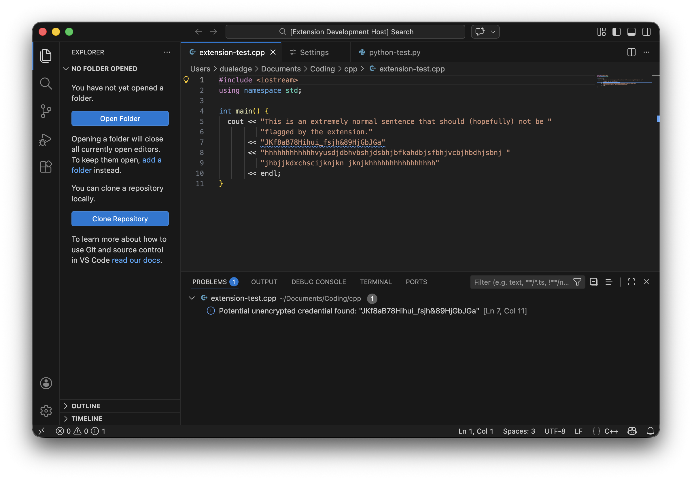
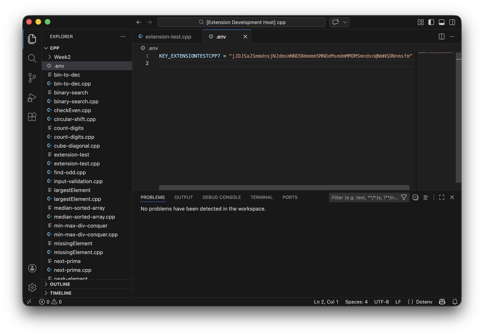
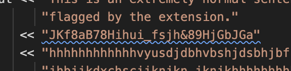
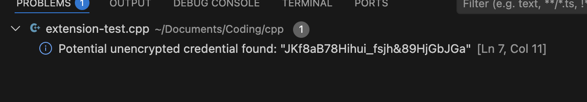

# __Code-Scrubber__

<p align="center"><a href="https://sarthaksahu03.github.io/code-scrubber_website/"><u>Go to website</u></a></p>

### A security enhancing extension that respects developer control and privacy

Code-Scrubber is a *VS Code* and *VSCodium* extension that *locally* scans your code for hardcoded API keys, tokens and passwords, and stops them from being committed. It helps prevent credential leaks in your GitHub repositories. Everything runs on your own device: your code and secrets are never sent anywhere.

> **Rotate, don't just delete.** Once a secret has been committed, it stays in git history (and in every clone and fork) even after you delete it from the code. If a real key leaks, revoke it with the provider and issue a new one. Code-Scrubber tells you this with every finding.

---

### Features

**In the editor**
  - Scans files when they are opened or saved, and underlines potential secrets.
  - Findings appear in the **Problems** panel with the secret masked (for example `AKIA…BZP`), so it is never shown in full.
  - Quick fixes: move a secret into `.env` (and add `.env` to `.gitignore`), or ignore a false positive.
  - Warns when `.gitignore` does not include `.env`.
  - `.env` encryption and decryption with a password (AES-256-GCM), from the Source Control view.

**On commit**
  - A **pre-commit hook** blocks commits that add secrets. The extension installs it automatically in each repository you open, and never overwrites an existing hook.
  - Commits made from VS Code's Source Control view can be pushed through with **Commit Anyway** in a dialog; every override is logged.
  - A **Scan repository for secrets** button in the Source Control view scans every file and the git history.

**Detection**
  - 18 known credential formats: AWS, GitHub, GitLab, Slack, Stripe, Google, OpenAI, Anthropic, SendGrid, Twilio and npm keys, private keys, JSON Web Tokens, passwords in database connection strings, and `password = "..."`-style assignments.
  - Shannon entropy scoring catches random-looking strings that match no known format.
  - Filters for common false positives: placeholders, hashes, UUIDs, file paths, URLs and version numbers.
  - Each finding has a confidence level: **high** (known format), **medium** (secret-like assignment) or **low** (entropy only).

**On the command line**
  - `scan`, `staged` and `history` commands, with text, JSON and SARIF 2.1.0 output. See [Pre-commit hook and command line](#pre-commit-hook-and-command-line).

### Planned features

  - Azure Key Vault quick fix: move a detected secret into Key Vault from the editor.
  - Live-key verification and step-by-step rotation guides for each provider.
  - Publishing on the VS Code Marketplace.

**Note that new features may be decided. Expect some issues, this project is early in development!**

---

### Screenshots

### Showcase





---

### Key highlighting and credential reporting





---

## Pre-commit hook and command line

The pre-commit hook and the scanner also work **without the VS Code extension**, from the command line. You need [Node.js](https://nodejs.org) and a copy of this repository.

### 1. Get the command

```bash
git clone https://github.com/twilight0963/code-scrubber.git
cd code-scrubber
npm install
npm link
```

`npm link` makes the `code-scrubber` command available in every folder. Check it with `code-scrubber --help`. To remove it later, run `npm unlink -g codescrubber`.

If you'd rather not link it, run the same commands with `node /path/to/code-scrubber/bin/code-scrubber.js` in place of `code-scrubber`.

### 2. Install the pre-commit hook

In the repository you want to protect:

```bash
cd my-project
code-scrubber install-hook
```

From now on, every `git commit` in that repository is scanned, and commits that add a high- or medium-confidence secret are blocked:

```text
HIGH    config.js:1:14  AWS Access Key ID (aws-access-key-id)  AKIA…BZP

1 finding, 1 at or above "medium"

Rotate these credentials, don't just delete them.
...
Commit blocked by Code-Scrubber.
To commit anyway (not recommended): git commit --no-verify
```

Good to know:
  - The hook only checks the lines your commit **adds**, so existing code doesn't block unrelated commits.
  - If the repository already has a pre-commit hook, `install-hook` does not replace it. Either run `code-scrubber install-hook --force`, or add this line to your existing hook yourself:

    ```bash
    node /path/to/code-scrubber/bin/code-scrubber.js staged || exit 1
    ```
  - The hook refers to your copy of Code-Scrubber by its full path. If you move or delete that folder, run `install-hook` again.
  - To remove the hook, delete `.git/hooks/pre-commit`.

**Using the [pre-commit](https://pre-commit.com) framework instead?** Add this to your `.pre-commit-config.yaml`:

```yaml
repos:
  - repo: https://github.com/twilight0963/code-scrubber
    rev: <commit SHA or a release tag newer than v1.0.0>
    hooks:
      - id: code-scrubber
```

### 3. Scan a project or its history

```bash
code-scrubber scan              # scan the current folder (gitignored files are skipped)
code-scrubber scan src config   # scan specific folders or files
code-scrubber staged            # scan what you are about to commit
code-scrubber history           # scan every commit, including secrets that were later deleted
code-scrubber history --range origin/main..HEAD   # only the commits on your branch
```

`history` shows where each secret was introduced and whether it is **still in the code** or **deleted from the code, but still in git history**. The second kind still needs rotating.

| Option | What it does |
|---|---|
| `--format text\|json\|sarif` | Output format. SARIF 2.1.0 works with GitHub code scanning and other tools. |
| `--output <file>` | Write the report to a file (a text summary is still printed). |
| `--fail-on high\|medium\|low\|none` | Lowest confidence that fails the command (default: `medium`). |
| `--update-baseline` | Accept all current findings, so only new ones are reported from now on. |
| `--baseline <file>` | Baseline file (default: `.code-scrubber-baseline.json`). |
| `--config <file>` | Config file (default: `.code-scrubber.json`). |
| `--no-color` | Plain output. |

Exit codes: `0` = nothing blocking, `1` = blocking findings, `2` = error.

### 4. Handle false positives

  - Add `code-scrubber:ignore` in a comment on the line, or `code-scrubber:ignore-next-line` on the line above.
  - Add `ignore.code-scrubber.diagnostics` in a comment anywhere in a file to ignore the whole file (not recommended).
  - Accept everything that is there today with `code-scrubber scan --update-baseline`. The baseline stores only a hash of each secret, never the secret itself.
  - Configure the repository with a `.code-scrubber.json` file in its root:

```json
{
  "failOn": "medium",
  "exclude": ["docs/**", "**/*.snap"],
  "allowlist": {
    "paths": ["test/fixtures/**"],
    "rules": ["high-entropy-string"],
    "values": ["^pk_test_"]
  }
}
```

### 5. Committing anyway

If you are sure a finding is safe to commit:
  - **From a terminal:** `git commit --no-verify` skips the hook.
  - **From VS Code or another app:** the hook shows a dialog listing the findings, with **Commit Anyway** and **Cancel Commit** (Cancel is the default). Overrides are recorded, with secrets masked, in `.git/code-scrubber-overrides.log`.

---

## In VS Code

| Command (Command Palette) | What it does |
|---|---|
| **Code Scrubber: Install pre-commit hook** | Installs the hook in the current repository and scans it. |
| **Code Scrubber: Remove pre-commit hook** | Removes the hook (only if Code-Scrubber installed it). |
| **Code Scrubber: Scan repository for secrets** | Scans all files and the git history. Also a 🔍 button in the Source Control view. |
| **Code Scrubber: Encrypt .env file** / **Decrypt .env.enc file** | Also 🔒 / 🔑 buttons in the Source Control view. |

| Setting | Default | What it does |
|---|---|---|
| `twilight0963.codescrubber.preCommitHook` | `always` | `always` installs the hook in every repository you open, `prompt` asks once per repository, `never` only installs it when you run the command. |
| `twilight0963.codescrubber.enableEncryption` | `true` | Shows the `.env` encryption buttons in the Source Control view. |

The status bar shows whether the current repository is protected: 🛡 **Secrets** (hook installed) or 🔓 **Secrets** (not installed). Click it to install or remove the hook.

> **Upgrading from 1.0.0:** the `.env` encryption format has changed. `.env.enc` files created with the 1.0.0 release can't be decrypted by newer versions. Decrypt them with 1.0.0 first, then encrypt them again.

---

### Extension is supported by the VS Code family of editors. Packaged in .vsix format.
